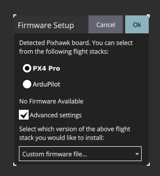

Load firmware to the FCU. Open QGC, and go to "Firmware" to upload ```.px4``` to FCU. Note that you should tick on "advance settings", and then select "Custom firmware file..." under the drop-down options.

   <div align=center>
   
   </div>

Click "OK", it should pop out a file selection panel, and select px4 files based on your FCU model.

- pixhawk 6c-mini (a, b) (v1.15): [px4_fmu-v5_default.px4](./pixhawk_6c_mini/px4_fmu-v6c_default.px4)

(feel free to update better firmware if you have tested it)